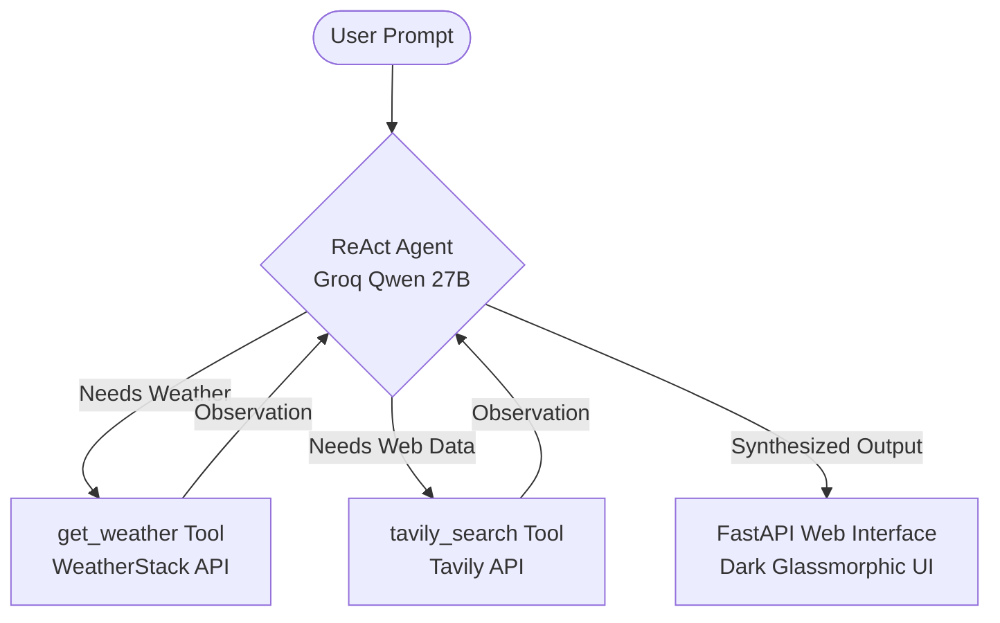

# 🌤️ Aetheris | Autonomous Weather & Web Intelligence Agent

An end-to-end, multi-tool AI Agent combining **ReAct (Reasoning + Acting)** decision loops, live meteorological telemetry from **WeatherStack**, and real-time internet search from **Tavily**, delivered through a sleek dark glassmorphism dashboard powered by **FastAPI**.

---

## 📑 Table of Contents
1. [Architecture & Workflow](#-architecture--workflow)
2. [Package Ecosystem (In Plain English)](#-package-ecosystem-explained-in-layman-terms)
3. [Quickstart & Installation](#-quickstart--installation)
4. [Environment Configuration](#-environment-configuration)
5. [How to Run the Application](#-how-to-run-the-application)
6. [Project Structure](#-project-structure)
7. [License](#-license)

---

## 🧠 Architecture & Workflow

The agent uses the **ReAct (Reason + Act)** pattern. Rather than guessing answers or relying on outdated training data, the model follows an iterative cycle:

1. **Thought**: Analyzes the user's intent (e.g., *"The user is asking for the latest news on a conflict and the current weather in New Delhi"*).
2. **Action**: Chooses the appropriate tool:
   - `get_weather` for atmospheric metrics (temperature, humidity, conditions).
   - `tavily_search_results_json` for breaking news, geopolitics, and current web data.
3. **Observation**: Collects the raw API response from the tool.
4. **Final Answer**: Synthesizes all gathered information into an accurate, clean response.



---

## 📦 Package Ecosystem Explained (In Layman Terms)

Here is a breakdown of every library in [`requirement.txt`](requirement.txt), what it does, and why it is included:

| Package | Layman Analogy | What It Does & Why We Use It |
| :--- | :--- | :--- |
| **`langchain`** | **The Orchestra Conductor** | The master framework that connects language models with external tools, prompts, memory, and multi-step reasoning agents (`AgentExecutor`). |
| **`langchain-core`** | **The Universal Blueprint** | Defines standard interfaces and base classes (like `BaseTool`, `Runnable`, `ChatPromptTemplate`) so different parts of the AI system communicate seamlessly without compatibility errors. |
| **`langchain-community`** | **The Tool Shed** | A collection of third-party community integrations. We use it to load built-in tools like `TavilySearchResults`. |
| **`langchain-groq`** | **The Rocket Engine Driver** | The specialized connector for Groq's LPU (Language Processing Unit) cloud. Allows querying high-speed models like `qwen/qwen3.8-27b` at blazing speeds. |
| **`langchain-openai`** | **The Alternative Engine** | The official connector for OpenAI models (like `gpt-4o-mini`). Available if you wish to swap Groq with OpenAI. |
| **`requests`** | **The Internet Messenger** | The standard Python library for sending HTTP web requests. We use it inside the `get_weather` tool to call the WeatherStack API and receive live temperature data. |
| **`tavily-python`** | **The AI Research Assistant** | An internet search engine built specifically for autonomous agents. Unlike typical search engines filled with ads, Tavily filters out noise and returns clean, fact-checked snippets ready for AI synthesis. |
| **`python-dotenv`** | **The Secret Keeper** | Reads key-value pairs from your local `.env` file and loads them into your computer's environment variables so your sensitive API keys are never hardcoded in source code. |
| **`langchainhub`** | **The Prompt Recipe Library** | Allows pulling battle-tested agent prompt templates directly from LangChain's public hub (such as `hwchase17/react`). |
| **`langsmith`** | **The Agent Microscope** | An observability and tracing platform for LLM applications. Used by LangChain under the hood for logging, debugging steps, and tracking execution speed. |
| **`ipykernel`** | **The Interactive Notebook Engine** | Enables Jupyter Notebooks (`.ipynb`) to run inside VS Code, allowing interactive step-by-step experimentation in the `research/` directory. |
| **`fastapi`** | **The Modern Web Server** | A high-performance, modern Python web framework. Powers our REST API endpoints (`/api/chat`, `/api/weather`, `/api/health`) and serves the frontend dashboard. |
| **`uvicorn`** | **The Engine Powering the Server** | An ultra-fast ASGI web server that actually executes and hosts the FastAPI application on your computer (`http://127.0.0.1:8000`). |
| **`certifi`** | **The Security Passport** | A curated collection of Root Certificates. Ensures your computer securely verifies SSL/TLS encryption certificates when making HTTPS requests on Windows. |

---

## 🚀 Quickstart & Installation

### 1. Prerequisites
- **Python 3.10+** installed on your system.
- Git installed.

### 2. Clone the Repository
```bash
git clone https://github.com/your-username/weather-agent.git
cd weather-agent
```

### 3. Create a Virtual Environment
```bash
python -m venv langagent
```

### 4. Activate the Virtual Environment
- **Windows (PowerShell):**
  ```powershell
  .\langagent\Scripts\Activate.ps1
  ```
  *(If PowerShell blocks script execution, run: `Set-ExecutionPolicy -Scope Process -ExecutionPolicy Bypass`)*

- **Windows (Command Prompt):**
  ```cmd
  langagent\Scripts\activate.bat
  ```

- **macOS / Linux:**
  ```bash
  source langagent/bin/activate
  ```

### 5. Install Dependencies
```bash
pip install -r requirement.txt
```

---

## 🔑 Environment Configuration

1. Copy the example configuration template:
   ```powershell
   copy .env.example .env
   ```
   *(On macOS / Linux: `cp .env.example .env`)*

2. Open `.env` and fill in your API keys:
   ```env
   # Required: Groq API Key (https://console.groq.com/keys)
   groq_api_key="gsk_..."

   # Required: Tavily Search Key (https://tavily.com/)
   tavily_api_key="tvly-..."

   # Required: WeatherStack Key (https://weatherstack.com/)
   weather_api_key="..."

   # Optional: OpenAI Key (if using gpt-4o-mini)
   open_api_key="sk-proj-..."
   ```

> [!WARNING]
> **Never commit your `.env` file to GitHub.** It contains sensitive credentials and is strictly ignored in `.gitignore`.

---

## 💻 How to Run the Application

### Option A: Launch the Full Web Dashboard (Recommended)
Run the unified launcher:
```powershell
python app.py
```
This will:
1. Start the FastAPI backend server on `http://127.0.0.1:8000`.
2. Automatically launch the dashboard in your default web browser.

### Option B: Run Queries from the Command Line (CLI Mode)
You can ask one-off questions directly from your terminal:
```powershell
python app.py "What is the current temperature in New Delhi and tell me about recent space missions?"
```

### Option C: Run Server with Live Reload (Developer Mode)
```powershell
uvicorn server:app --host 127.0.0.1 --port 8000 --reload
```

---

## 📂 Project Structure

```text
weather-agent/
├── .env.example            # Environment variables template (safe to commit)
├── .gitignore              # Industry-standard exclusion rules (secrets, venvs, cache)
├── ReadMe.md               # Comprehensive documentation and project guide
├── requirement.txt         # Pinned project dependencies
│
├── app.py                  # Main unified entry point (starts Web UI or runs CLI query)
├── agent.py                # Core ReAct LangChain agent logic & Weather/Tavily tools
├── server.py               # FastAPI backend with REST endpoints (/api/chat, /api/weather)
│
├── static/                 # Frontend Web Dashboard
│   ├── index.html          # Semantic HTML5 layout
│   ├── style.css           # Vanilla CSS dark glassmorphism design system
│   ├── app.js              # Client-side agent interaction & markdown rendering
│   └── assets/             # Logos and icons
│       └── logo.jpg        # Aetheris Agent branding icon
│
└── research/               # Experimental Jupyter Notebooks
    └── agentDemonstartion.ipynb
```

---

## 🛡️ Best Practices & Standards Followed

- **Secret Isolation**: Clear separation of secret credentials via `.env` and `.gitignore`.
- **Modular Design**: Agent business logic (`agent.py`) is decoupled from the web layer (`server.py`).
- **Telemetry Transparency**: Every agent decision reveals tool names, inputs, and intermediate observations.
- **Resilience**: SSL certificate normalization with `certifi` and error handling for external API limits.

---

## 📄 License
MIT License. Free for educational and commercial use.
